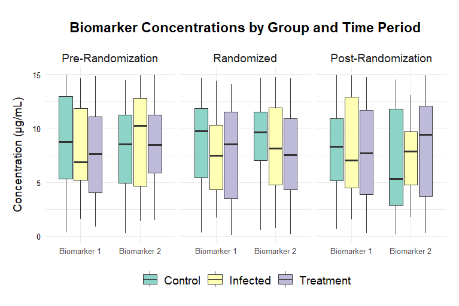

```{r setup, include=FALSE}
knitr::opts_chunk$set(echo = FALSE, warning = FALSE, message = FALSE)
```

```{css, echo = FALSE}
/* Custom CSS for the Table of Contents */
.tocify {
  border: 1px solid #ddd;
  border-radius: 4px;
  padding: 10px;
  background-color: #f9f9f9;
}

.tocify-header {
  font-size: 18px;
  font-weight: bold;
  color: #2c3e50;
}

.tocify-subheader {
  padding-left: 15px;
}

.tocify-subheader li {
  list-style-type: none;
}

.tocify-subheader li a {
  color: #333;
  text-decoration: none;
}

.tocify-subheader li a:hover {
  color: #3498db;
  text-decoration: underline;
}
```
\pagebreak
# About

The following are a collage of visualizations from different projects. I've compiled them here to demonstrate how I approach stylizing different types of visualizations. To view the analytics projects and code, [please click here to visit my GitHub profile](https://github.com/caitl-k).

# Line Graphs

## Global Lab Supply Item Demand


## Decision Tree Model Evaluation


# Bar Graphs

## Bed Supply Analysis


## Admissions Analysis


# Dot Plots

## Bed Supply Analysis


# Box Plots

## Biomarker Concentrations



# Histograms

## Biomarker Concentration


# Q-Q Plots

## Biomarker Concentration


```{css, echo = FALSE}
body {
  font-family: 'Arial', sans-serif;
  line-height: 1.6;
  color: #333;
}

h1, h2, h3 {
  color: #2c3e50;
}

h1 {
  border-bottom: 2px solid #2c3e50;
  padding-bottom: 10px;
}

h2 {
  border-bottom: 1px solid #2c3e50;
  padding-bottom: 5px;
}

a {
  color: #3498db;
  text-decoration: none;
}

a:hover {
  text-decoration: underline;
}

.navbar-default {
  background-color: #2c3e50;
  border-color: #2c3e50;
}

.navbar-default .navbar-nav > li > a {
  color: #ecf0f1;
}

.navbar-default .navbar-nav > li > a:hover {
  color: #bdc3c7;
}

.tocify {
  border: 1px solid #ddd;
  border-radius: 4px;
}

.tocify-header {
  background-color: #2c3e50;
  color: #ecf0f1;
  padding: 10px;
  border-radius: 4px 4px 0 0;
}

.tocify-subheader {
  padding-left: 20px;
}

.tocify-subheader li {
  list-style-type: none;
}

.tocify-subheader li a {
  color: #333;
}

.tocify-subheader li a:hover {
  color: #3498db;
}
```
